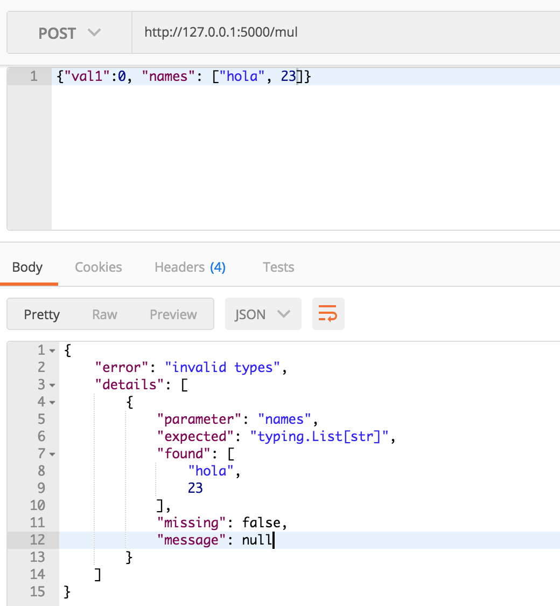
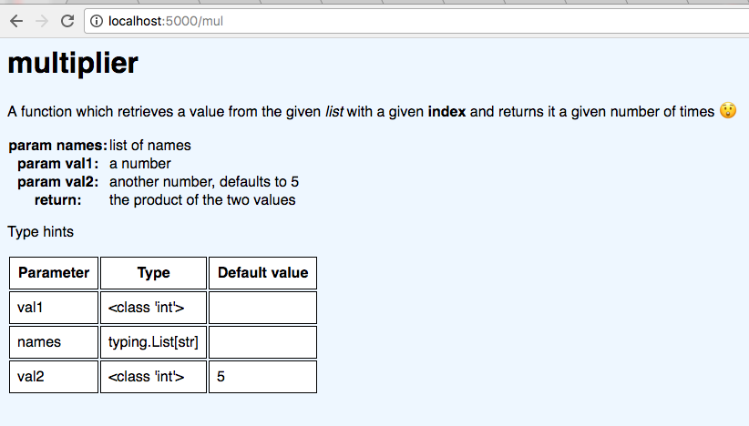
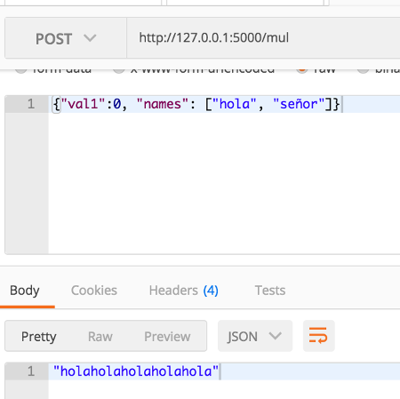

.. image:: https://travis-ci.org/jacopofar/flask-typed-mounter.svg?branch=master
    :target: https://travis-ci.org/jacopofar/flask-typed-mounter
    :alt: Travis CI badge

Flask typed mounter
###################

Exposes a plain Python function as an HTTP endpoint using Flask, performs type checking between HTTP request and Python 3.6 type hints to give the client a clear error before calling the function. A GET request retrieves the documentation and type hints for that function

Work in progress, don't hesitate forking/asking/suggesting

See `example.py` for a complete example, but in short:

.. code-block:: python

   @tm.attach_endpoint('/mul', methods=['POST'], auto_document=True)
   def multiplier(val1: int, val2: int = 5):
       return val1 * val2

this will expose your multiplier function at `/mul`, with the result that a POST of a JSON will be validated against type hints and give a JSON answer or nice error message if not matching. A GET for that endpoint will show the rendered pydoc string and the type hints.

The endpoint can be called by sending a JSON or a form, the former allows for more structured requests and the second allows to send files.

Type checking (based on Python 3.6 typing):

Documentation:

Correct call:

A customized doc template can be passed as `doc_html_template` when instantiating the server and documentation endpoint can be disabled on single functions by passing `auto_document=False`.

You can also accept files (which by default is not allowed) by passing the `accept_files` parameter set to `True`. Additionally, you can limit the file extensions by passing the `allowed_extensions` list; if this parameter is omitted, any extension is accepted.

By default there is **no limit on the size of the files** which can be uploaded. You can set it up in Flask by setting `app.config['MAX_CONTENT_LENGTH']` to the maximum number of bytes.

Files will be saved in a temporary directory and be given to the function as a `pathlib.Path` object, if and only if that's the type annotation used by the function. Files are deleted after the function has been invoked, but the function itself can of course copy the contend during its execution.

TODO
####

- add logging
- add support for GET and other verbs
